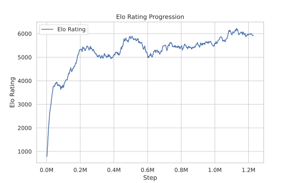

# (Gumbel) AlphaZero in JAX

This is a **pure JAX implementation** of *(Gumbel) AlphaZero*, designed for efficiency and simplicity. The code is **highly concise and easy to understand**, making it a great reference for those interested in AlphaZero implementations.  

On a single **RTX 4070 Ti**, it can train a **strong 9×9 Gomoku agent** in approximately **4 to 5 hours**. The implementation is built on **PGX**, supporting **Gomoku** as well as other board games available in the PGX framework. It leverages the **Mctx** library for **Monte Carlo Tree Search (MCTS) and self-play**, ensuring effective decision-making and policy improvement.  

*This README introduction was generated with the help of ChatGPT.*  

<p align="center">
  
</p>

-----------------


### Training

```shell
python3 main.py
```

### Play

```shell
python3 eval.py
```

### TODO

- [ ] Chinese checkers